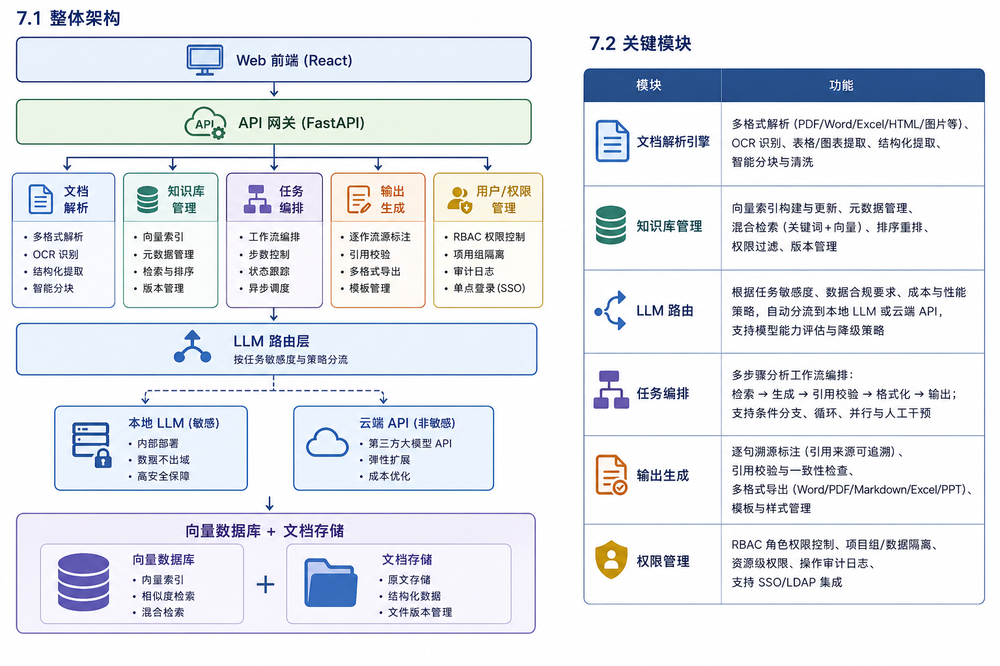
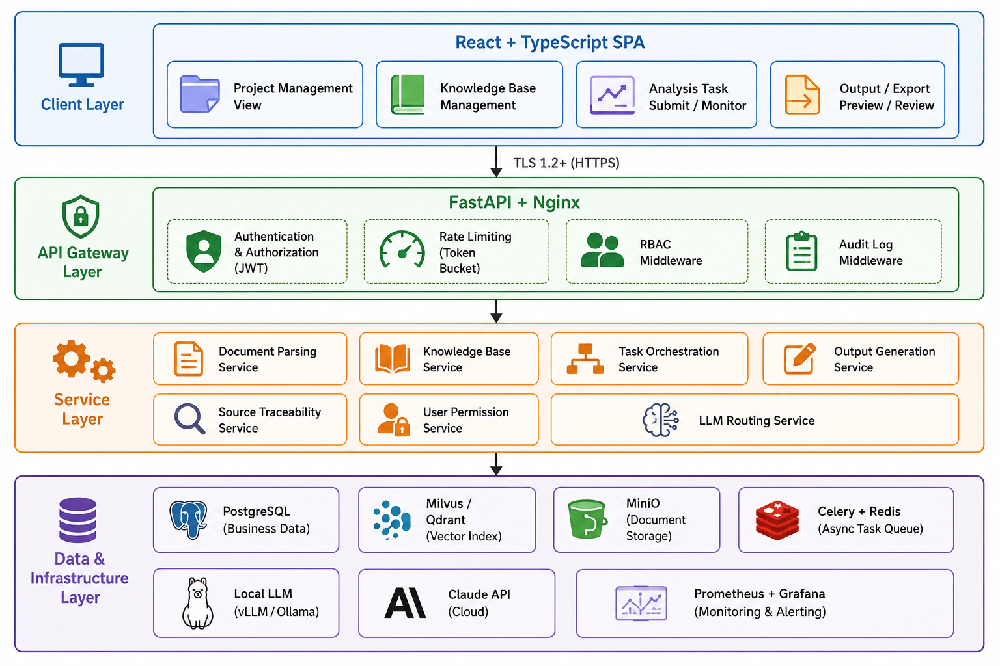
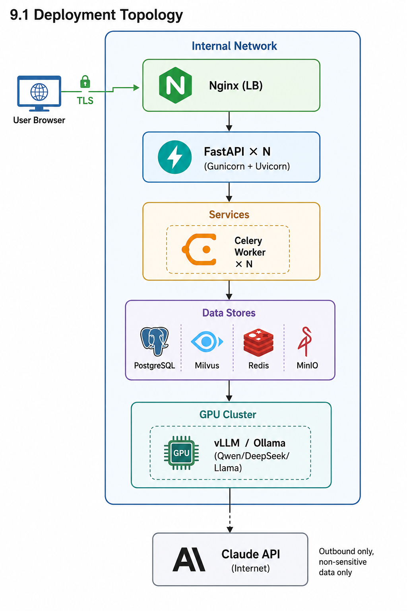
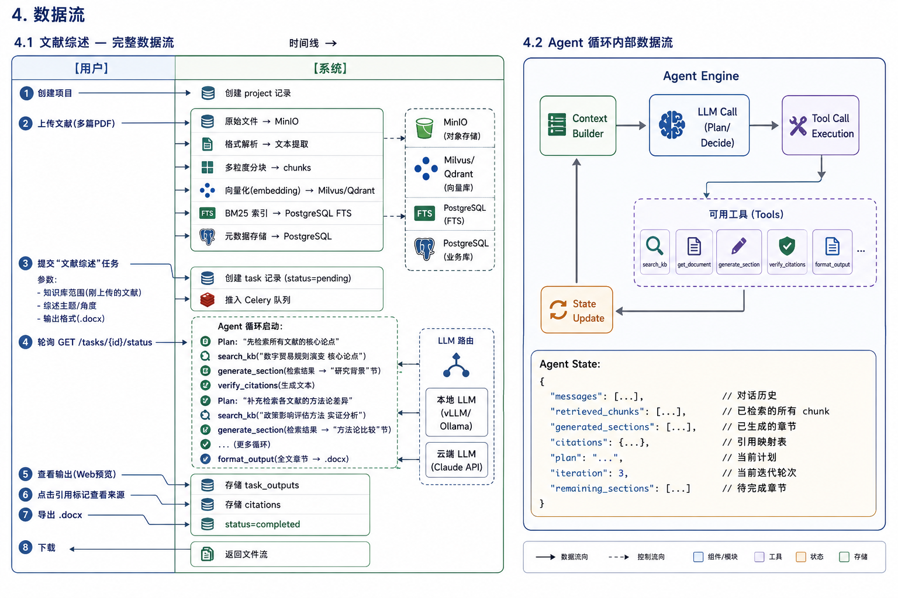

# EconAI — Institutional-Grade AI Economic Policy Analysis Toolkit

> **Created**: 2026-05-17 &nbsp;|&nbsp; **Status**: All 10 modules complete (376/376 subtasks) &nbsp;|&nbsp; **Tests**: 638 passing

EconAI is an AI-powered toolkit for economic policy research institutions. It combines LLM reasoning with a trusted evidence base to generate structured analysis reports — literature reviews, policy drafts, policy comparisons, and technical interpretations — with sentence-level source provenance, and exports to Markdown, .docx (GB/T 9704), .xlsx, and .pptx.

## Project at a Glance

| Stat | Value |
|------|-------|
| **Created** | 2026-05-17 (13 days of active development) |
| **Git commits** | 50 |
| **Contributor** | 1 (NZSpark) |
| **Microservices** | 7 + API Gateway = 8 backend modules |
| **Docker containers** | 20 (8 app + 12 infrastructure) |
| **Total source files** | 315 (.py + .ts + .tsx + .sql) |
| **Total project files** | ~470 (all types, excluding node_modules/.venv) |
| **Production code** | 26,355 lines (Python 20,453 + TypeScript/TSX 5,532 + SQL 370) |
| **Test code** | 22,493 lines (Python 18,279 + TypeScript/TSX 4,214) |
| **Total code** | **48,848 lines** |
| **Code-to-test ratio** | 1.17:1 (near 1:1) |
| **Test count** | 638 (Python 622 + TypeScript 16), all pure mock |

## Architecture





8 backend modules behind an API gateway, deployed via Docker Compose (20 containers):

```
Client (React 19 + TypeScript 5 + Ant Design 6)
    → Nginx (reverse proxy + TLS termination)
        → API Gateway (FastAPI) :8000   — JWT auth, RBAC, rate limiting, audit, reverse proxy
            ├── user-service :8007      — Auth, RBAC (4 roles × 6 ops), LDAP/SSO, GDPR
            ├── llm-router :8004        — Sensitivity-based routing (local vLLM ↔ Claude API)
            ├── citation-service :8005  — Inline [ref:doc:page] parsing, verification, formatting
            ├── document-service :8001  — Upload, parse (8 formats), OCR, multi-granularity chunking
            ├── output-service :8006    — Generate Markdown / .docx(GB/T 9704) / .xlsx / .pptx
            ├── kb-service :8002        — Embedding, vector index, hybrid search (vector+BM25+Reranker)
            └── orchestration-service :8003 — Agent engine (ReAct loop), task lifecycle, tool execution
```



### Data flow

1. **Ingest**: Upload documents → parse (8 formats + OCR) → multi-granularity chunking → embed → index (Milvus + PostgreSQL FTS)
2. **Analyze**: User creates task → Agent engine executes ReAct loop (Plan → Retrieve → Generate → Verify → Decide, max 5 iterations)
3. **Cite**: LLM outputs inline `[ref:doc_id:page_range]` → Citation service verifies against source chunks → classifies confidence (direct / fuzzy / uncertain)
4. **Export**: Output service renders Markdown preview + generates .docx / .xlsx / .pptx with citations



### Key design decisions

| Decision | Approach |
|----------|----------|
| **LLM routing** | Sensitivity analysis: high sensitivity → local model (vLLM/Ollama), low sensitivity → Claude API. User can override per task. |
| **Hybrid search** | Vector semantic (top-50) + BM25 keyword (top-50) → RRF fusion (k=60) → BGE-Reranker → top-10 |
| **Chunking** | Paragraph-level (~300 tokens) for precise retrieval + section-level (~2000 tokens) for context window |
| **Agent loop** | ReAct variant (Plan → Retrieve → Generate → Verify → Decide), max 5 iterations; forces format_output on overflow |
| **Citations** | Inline `[ref:doc_id:page_range]` format, verified via page range matching + semantic similarity (threshold 0.85) |
| **GB/T 9704** | Chinese government document standard for .docx: specific fonts (小标宋/黑体/楷体/仿宋), margins, heading numbering |
| **Tests** | Pure mock — all external dependencies (DB, Redis, Milvus, MinIO, LLM APIs) mocked; 638 tests, zero infra needed |

## Module Status

| Module | Service | Port | Subtasks | Key Capabilities |
|--------|---------|------|----------|------------------|
| M10 | Infrastructure | — | 34/34 | Docker Compose, PostgreSQL schema, Nginx, Prometheus+Grafana, Celery config, Alembic migrations |
| M8 | User Service | 8007 | 42/42 | JWT auth, RBAC (4 roles × 6 ops), LDAP/SSO, audit log consumer, GDPR APIs |
| M5 | LLM Router | 8004 | 33/33 | Model registry, sensitivity routing, ClaudeAdapter + LocalAdapter, circuit breaker, retry with backoff |
| M6 | Citation Service | 8005 | 30/30 | Inline `[ref:...]` parser, verification (page + semantic), formatters (Markdown/docx/xlsx/pptx) |
| M1 | API Gateway | 8000 | 28/28 | JWT middleware, RBAC middleware, Redis token bucket rate limiter, audit logging (pub/sub), httpx reverse proxy |
| M2 | Document Service | 8001 | 43/43 | 8-format parsing (PDF/Word/MD/Excel/PPT/Email/HTML/Image-OCR), multi-granularity chunking, MinIO storage, Celery pipeline |
| M7 | Output Service | 8006 | 39/39 | Markdown (Jinja2), .docx (GB/T 9704), .xlsx (comparison matrix), .pptx generation, MinIO output storage |
| M3 | KB Service | 8002 | 38/38 | Embedding (text2vec/m3e), Milvus/Qdrant vector store, BM25 (PostgreSQL FTS), hybrid search + reranker, pagination, lifecycle management |
| M4 | Orchestration Service | 8003 | 54/54 | ReAct agent engine, 6 tools, task state machine, sensitivity analysis, Jinja2 prompt templates, progress tracking |
| M9 | Frontend | 5173 | 38/38 | React 19 + TypeScript 5 + Vite 8 + Ant Design 6, auth flow, project/KB/task management, Markdown preview with citation badges |

## Quick Start

### Prerequisites

| Software | Version | Purpose |
|----------|---------|---------|
| Python | 3.12+ (3.14.5 verified) | Backend runtime |
| uv | 0.5+ | Python package manager |
| Node.js | 18+ (26.x verified) | Frontend runtime |
| Colima / Docker | 0.10+ / 24.0+ | Container runtime |
| Docker Compose | 2.20+ | Multi-container orchestration |
| Tesseract | 5.5+ | OCR engine (chi_sim language pack) |

### One-time setup

```bash
# Install runtime dependencies (macOS)
brew install colima docker docker-compose python@3.14 uv node tesseract
colima start --cpu 4 --memory 8 --disk 60

# Clone and enter project
git clone <repo-url> && cd EconAI

# Start infrastructure services (PostgreSQL, Redis, Milvus, MinIO, Nginx, Prometheus, Grafana)
docker compose up -d
docker compose ps   # verify all healthy

# Install per-service dependencies
for dir in api-gateway services/*/ shared; do
    (cd "$dir" && uv sync)
done
cd frontend && npm install
```

### Start developing

```bash
# Start infrastructure
docker compose up -d

# Start all backend services + frontend (see doc/manualstart.md for step-by-step)
./deploy/manualstart.sh

# Or start a single service for focused development
cd services/kb-service && uv run uvicorn kb_service.app:app --port 8002 --reload
```

### Quality gate (per-service, must pass before commit)

```bash
# Backend
cd <service-dir> && pytest --tb=short && mypy . --strict && ruff check .

# Frontend
cd frontend && npx tsc -b --noEmit && npm run lint && npm test
```

## Technology Stack

### Backend (Python 3.12+)

| Layer | Technology |
|-------|-----------|
| Web framework | FastAPI + Uvicorn (dev) / Gunicorn (prod) |
| Data validation | Pydantic v2 + pydantic-settings |
| ORM | SQLAlchemy 2.x async + asyncpg |
| Task queue | Celery + Redis (broker + backend) |
| Auth | python-jose (JWT), bcrypt, pyjwt, python-ldap |
| LLM SDK | anthropic (Claude Messages API) |
| HTTP client | httpx (async, for reverse proxy + inter-service calls) |
| Doc parsing | PyMuPDF, pdfplumber, python-docx, openpyxl, pandas, python-pptx, BeautifulSoup4, lxml, Pillow |
| Output gen | python-docx (GB/T 9704), openpyxl, python-pptx, Jinja2 |
| Observability | structlog, prometheus-client, starlette-prometheus |
| Token counting | tiktoken |

### Data Stores (Docker)

| Store | Technology | Purpose |
|-------|-----------|---------|
| PostgreSQL 16 | `postgres:16-alpine` | Business data + FTS (BM25) + JSONB |
| Redis 7 | `redis:7-alpine` | Celery broker, token blacklist, rate limit counters, pub/sub |
| Milvus | `milvusdb/milvus:latest` | Vector index (1024d embeddings) |
| MinIO | `minio/minio:latest` | S3-compatible object storage (documents + outputs) |

### Frontend (Node.js)

| Layer | Technology |
|-------|-----------|
| Framework | React 19 + TypeScript 5 (strict mode) |
| Build | Vite 8 |
| UI library | Ant Design 6 + @ant-design/icons |
| Routing | React Router 7 |
| HTTP | Axios (JWT auto-inject + 401 refresh retry) |
| Markdown | react-markdown |
| Testing | Vitest 4 + Testing Library + jsdom |

### Dev tools

| Tool | Version | Purpose |
|------|---------|---------|
| pytest | 9.0.3 | Test framework (638 tests, pure mock) |
| mypy | 2.1.0 | Static type checking |
| ruff | 0.15.13 | Linting + formatting (Rust) |
| ESLint | 10.3 | Frontend linting |

## Key Features

### Four analysis task types

| Type | Use Case | Output |
|------|----------|--------|
| **Literature Review** | Systematic review of uploaded literature | Structured report with comparison matrix |
| **Policy Draft** | Draft policy documents | GB/T 9704 compliant .docx |
| **Policy Comparison** | Cross-analysis of multiple policy documents | Multi-dimension comparison matrix (.xlsx) |
| **Tech Interpretation** | Interpret technical standards/regulations | Compliance analysis with glossary |

### Sentence-level citation provenance

Every AI-generated assertion is traceable to its source:

- **Green** = Direct citation (high confidence, page range match)
- **Yellow** = Fuzzy citation (medium confidence, semantic match)
- **Red** = Uncertain (low confidence, inferred content)

Click any citation badge in the UI to see: source document, page range, original excerpt, and AI-generated sentence.

### Hybrid LLM deployment

- **High sensitivity** (internal docs, policy drafts) → local LLM (vLLM/Ollama, OpenAI-compatible API)
- **Low sensitivity** (public docs) → Claude API
- User can explicitly set sensitivity per task via the UI; system auto-detects otherwise

### Enterprise security

- JWT (access + refresh tokens) with Redis blacklist
- RBAC: 4 roles (analyst, senior_researcher, project_admin, system_admin) × 6 operations
- Project-group isolation: KB and results scoped per group
- Full audit trail (Redis pub/sub → PostgreSQL), GDPR data subject APIs
- Rate limiting: Redis token bucket (per-user + per-IP)

## Module Details

### M1 — API Gateway (port 8000)

Entry point for all client requests. JWT verification + RBAC enforcement + rate limiting on every request. Config-driven route registry with httpx reverse proxy to 7 backend services. Publishes audit events to Redis `audit:log` channel. Unified error responses, CORS, X-Request-ID propagation, 100MB request limit.

### M2 — Document Service (port 8001)

Multi-format parsing pipeline: PDF (PyMuPDF), Word (python-docx), Markdown/txt, Excel/CSV, PowerPoint, Email (.eml), HTML/MHTML, Image/Image-PDF OCR (Tesseract chi_sim+eng). Format identification via magic bytes + extension fallback with PDF text-layer detection. Produces paragraph-level (~300 tokens) and section-level (~2000 tokens) chunks. State machine: pending → parsing → ready/error with reindex recovery. Publishes index events to Redis `kb:index:request`.

### M3 — KB Service (port 8002)

Embedding generation (text2vec/m3e) with Redis cache. Vector store abstraction over Milvus/Qdrant. BM25 keyword search via PostgreSQL FTS with GIN index. Hybrid search pipeline: parallel vector(top-50) + BM25(top-50) → RRF fusion(k=60) → reranker → top-10. Server-side pagination with `page`/`page_size`/`pages`. Consumes `kb:index:request` channel for auto-indexing. Supports KB isolation (per-project and institutional cross-project) with archive/restore lifecycle.

### M4 — Orchestration Service (port 8003)

Agent engine implementing ReAct variant: Plan → Execute (6 tools) → Observe → Update Progress, max 5 iterations. Task state machine: pending → running/cancelled → completed/failed. 6 agent tools: search_kb, generate_section, verify_citations, extract_key_claims, compare_policies, format_output. Tool execution with 60s timeout, 1 retry, exception isolation. Sensitivity analysis (5 rules). Jinja2 prompt templates for 4 task types. Forces format_output when iteration limit reached.

### M5 — LLM Router (port 8004)

Model registry + sensitivity-based routing. ClaudeAdapter (anthropic SDK, tool_use bidirectional conversion, custom `ANTHROPIC_API_BASE_URL`) + LocalAdapter (OpenAI-compatible /v1/chat/completions). Circuit breaker pattern with retry + exponential backoff. Token usage tracking.

### M6 — Citation Service (port 8005)

Inline `[ref:...]` parser supporting single/multi/uncertain references, Chinese/English sentence splitting. Citation verifier: page range matching + semantic similarity (cosine_similarity, threshold 0.85) → confidence classification. Formatters: Markdown (GFM footnotes), .docx (footnotes/endnotes), .xlsx (引用清单 sheet), .pptx.

### M7 — Output Service (port 8006)

Multi-format generation: Markdown (Jinja2, YAML front-matter, [ref:] → [^n] footnotes), .docx (GB/T 9704-2012: 版头/主体/版记, heading mapping, reference list), .xlsx (comparison matrix + citation list + data summary), .pptx (cover, TOC, findings, recommendations, references). Format router for parallel generation. MinIO storage with presigned URLs.

### M8 — User Service (port 8007)

JWT auth with bcrypt password hashing, access/refresh token flow. RBAC: 4 roles × 6 operations. LDAP/SSO integration. User/group/project CRUD. Audit log consumer (Redis pub/sub → PostgreSQL). GDPR data subject APIs (access, rectify, delete, export). Alembic migrations.

### M9 — Frontend SPA

React 19 + TypeScript 5 + Vite 8 + Ant Design 6 + React Router 7. Auth flow (login, token auto-refresh, route guards). Project management (table/cards, pagination, status search, archive). Knowledge base (drag-and-drop upload with progress, document list, hybrid search with chunk highlight). Task management (type selection, sensitivity selector, status polling, step progress bar). Output view (Markdown preview, citation badges with color-coded confidence, citation drawer, export format selector). Admin (user CRUD, group management, audit log viewer).

## Project File Breakdown

| Category | Files | Lines |
|----------|-------|-------|
| Backend Python (production) | 170 | 20,453 |
| Backend Python (tests) | 75 | 18,279 |
| Frontend TypeScript (production) | 28 | 2,070 |
| Frontend TSX (production) | 40 | 3,462 |
| Frontend TS/TSX (tests) | 21 | 4,214 |
| SQL (schema + seed) | 2 | 370 |
| Dockerfiles | 8 | — |
| docker-compose files | 3 | — |
| YAML/YML configs | 12 | — |
| Jinja2 prompt templates | 5 | — |
| Shell scripts | 2 | — |
| Markdown docs | 58 | — |
| TOML configs | 10 | — |
| JSON configs | 8 | — |
| **Total** | **~470** | **48,848** |

## Documentation

| Document | Content |
|----------|---------|
| `doc/proposal.md` | Requirements, user stories, MVP scope, compliance (等保二级 + GDPR) |
| `doc/high-level-design.md` | Architecture, data flow, API design, Agent engine, security design |
| `doc/detailed-design.md` | Per-module API specs, internal interfaces, algorithms, configuration |
| `doc/tasks/*.md` | Subtask checklists per module (376 total) |
| `doc/tasks/progress.md` | Dependency graph, suggested order, progress tracking |
| `doc/devtools.md` | Dev environment setup, all tool/packages versions, quality gate configs |
| `doc/operation.md` | Deployment, monitoring, backup/restore, scaling, troubleshooting |
| `doc/usermanual.md` | End-user guide: login, project management, KB upload, task creation, output review |
| `doc/manualstart.md` | Step-by-step manual dev server startup per terminal |
| `templates/prompts/*.j2` | Jinja2 System Prompt templates for 4 task types |
| `templates/output/*.yaml` | Style configs for .docx/.pptx/.xlsx generation |

## Deployment

See **[doc/operation.md](doc/operation.md)** for full deployment and operations guide.

```bash
# Production deployment
cp .env.template .env   # configure all secrets
./deploy/deploy.sh build
./deploy/deploy.sh start
./deploy/deploy.sh status  # verify 20 containers healthy
```

**Key operations**: `./deploy/deploy.sh {start|stop|restart|status|logs [service]|build}`

**Monitoring**: Prometheus (`:9090`) + Grafana (`:3000`). MinIO Console (`:9001`).

## License

Proprietary. All rights reserved.
